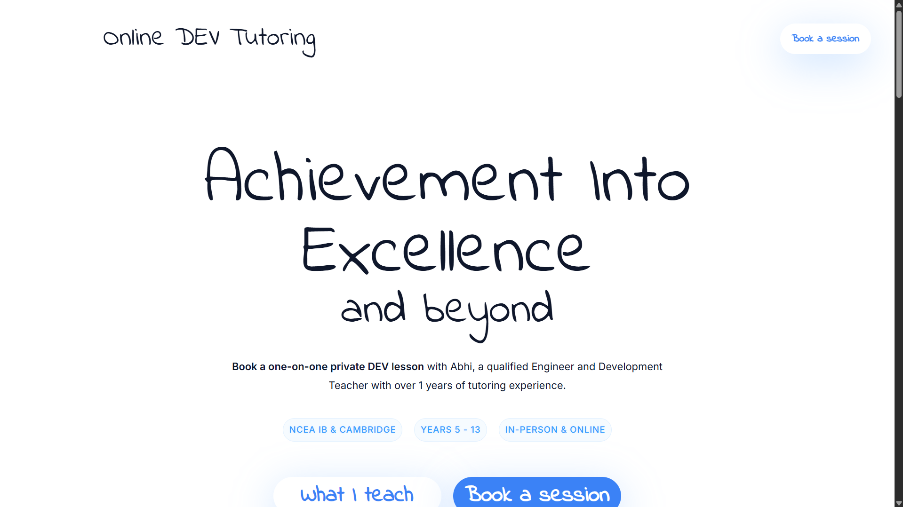
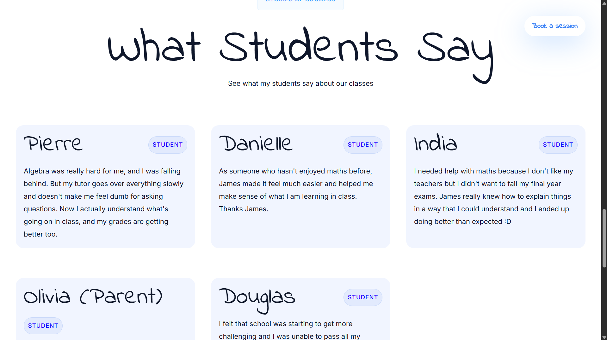
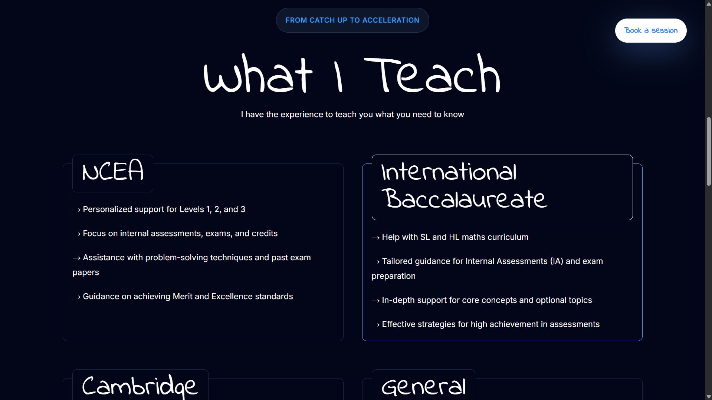

# Tailwind CSS Project Showcase

This project demonstrates the application of **Tailwind CSS** to create a visually appealing and responsive layout. The project leverages Tailwind’s utility-first classes to build a modern UI with clean and consistent styling.

## 🎥 Video Demo

Here’s a quick demo video of the project in action:


> **Note**: If the video preview does not appear, download it to view locally.

## 📸 Screenshots

Below are some screenshots of the project showcasing various aspects of the layout and design:


  
  
  


## 💡 Project Highlights

- 🌟 Built with **Vite**, **vanilla HTML**, and **Tailwind CSS**.
- 🎨 Fully responsive layout.
- ⚡ Smooth and modern UI interactions.
- 📱 Mobile-friendly and desktop-ready.

## 🚀 Getting Started

To run this project locally:

1. Clone this repository:
    ```bash
    git clone https://github.com/your-username/tailwind-project-showcase.git
    ```
2. Navigate to the project directory:
    ```bash
    cd tailwind-project-showcase
    ```
3. Install dependencies:
    ```bash
    npm install
    ```
4. Start the development server:
    ```bash
    npm run dev
    ```
5. Open the provided local server URL in your browser to view the project.

## 📚 Technologies Used

- **Vite**: Fast development build tool.
- **Vanilla HTML**: Simple and lightweight markup.
- **Tailwind CSS**: Utility-first CSS framework.

---

Thank you for checking out this project! Feel free to fork, clone, and build upon it. If you have any questions or suggestions, let me know!
